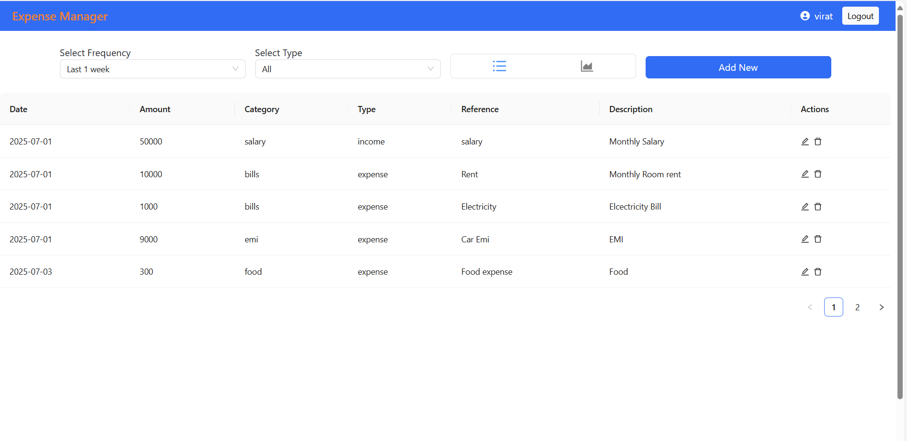
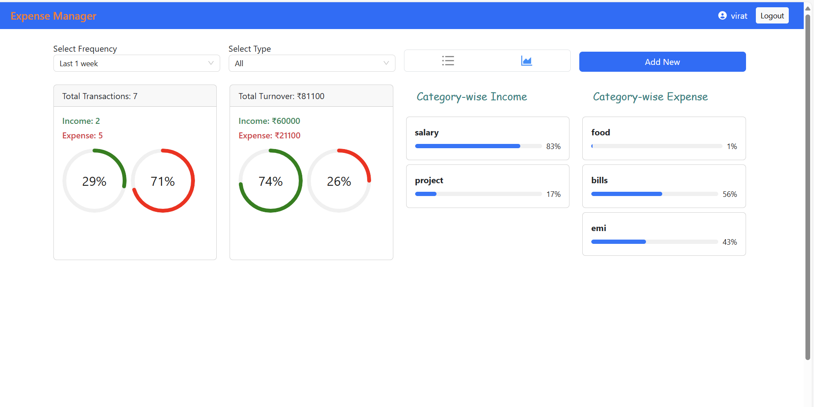

# 💰 Expense Tracker App

A modern, responsive **Expense Management System** that helps users track their income and expenses efficiently. This web app allows users to add, view, filter, and analyze their financial transactions with ease.



---

## 🚀 Features

- 🔐 **User Authentication** (Login / Logout)
- ➕ **Add New Transactions** (income/expense)
- 🗂️ **Categorize** expenses (food, bills, emi, etc.)
- 📅 **Date-wise Filtering** (e.g., last 1 week)
- 📊 **Analytics View** to understand spending habits
- 📝 **Edit/Delete** entries easily
- 📱 **Responsive Design** (works across devices)

---

## 📊 Tech Stack

- **Frontend:** React.js, Tailwind CSS, Ant Design, Bootstrap
- **Backend:** Node.js, Express.js
- **Database:** MongoDB
- **Authentication:** JWT

---

## 📷 Preview

| Table View                          | Graphical View (Analytics) |
|------------------------------------|-----------------------------|
|  |

---

## 📦 Getting Started

### 1. Clone the Repository
```bash
git clone https://github.com/your-username/expense-tracker.git
cd expense-tracker
